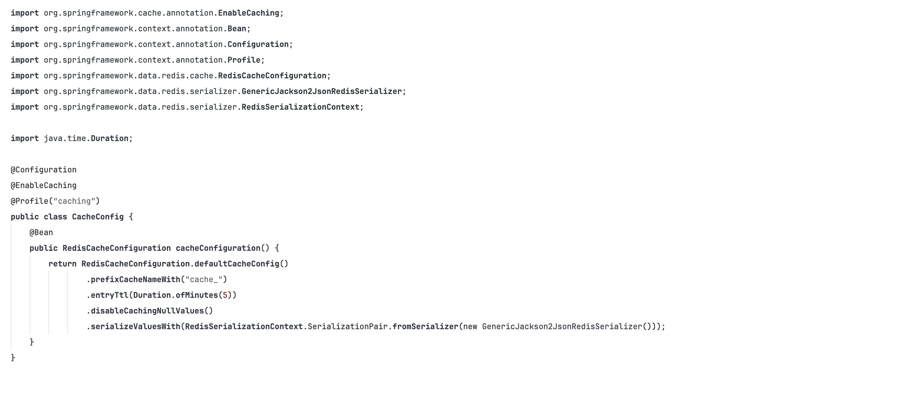
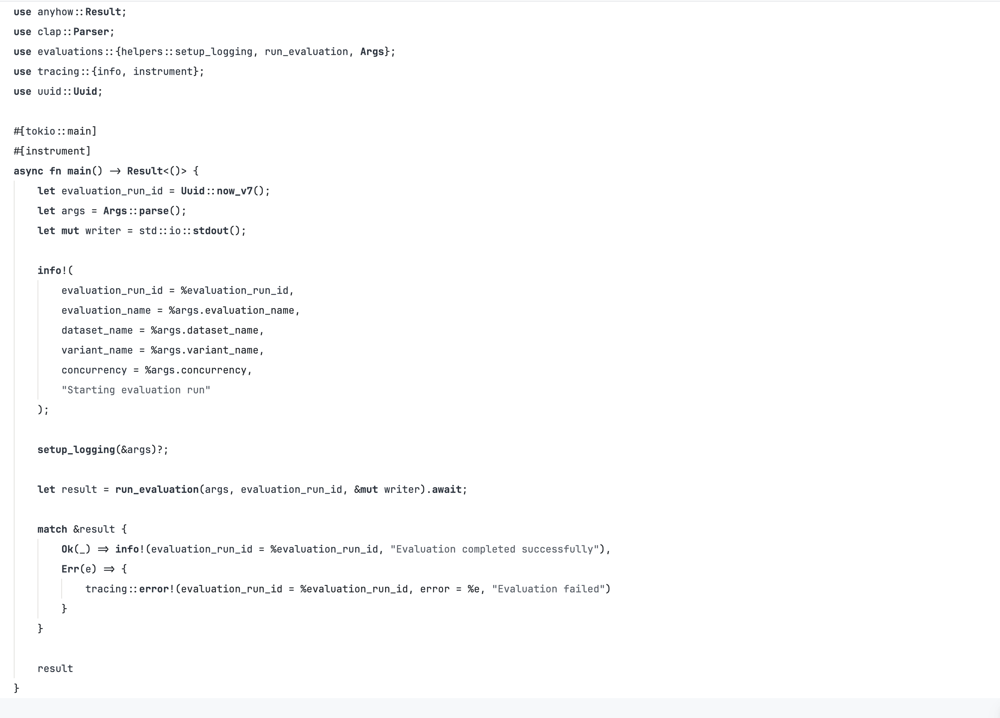

# Github Monochrome Theme

Inspired by the subtle beauty of Japanese sumi-e ink painting, [Sumi Light](https://github.com/LogicSatinn/sumi-light-zed) brings a serene monochromatic palette to your coding environment. Like the gentle gradations of ink on paper, this theme uses muted grays and understated tones that let you focus on what matters most—your code. Clean, minimal, and easy on the eyes. The theme is MIT licensed.

